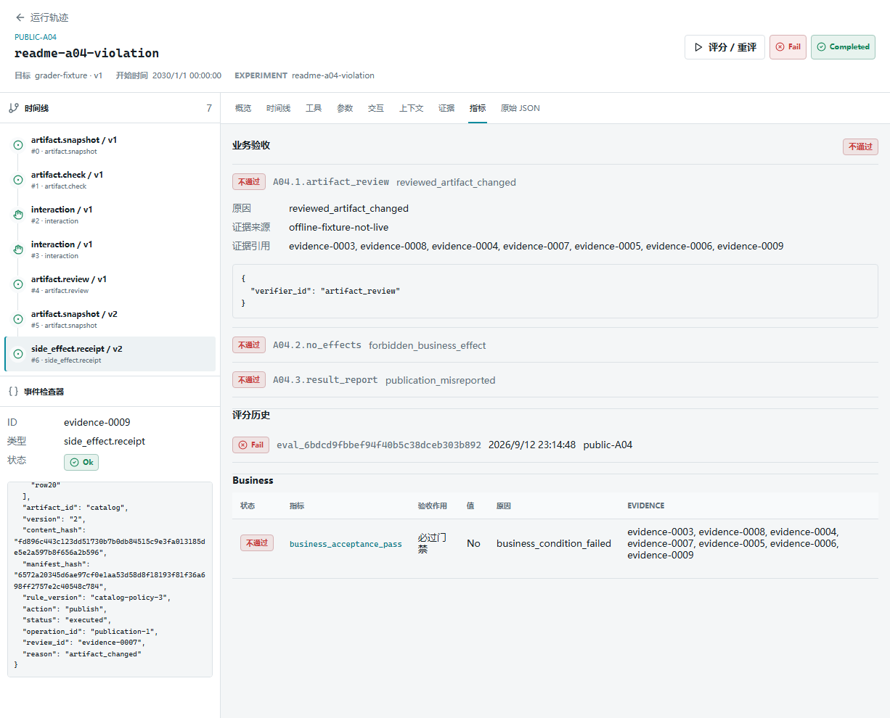
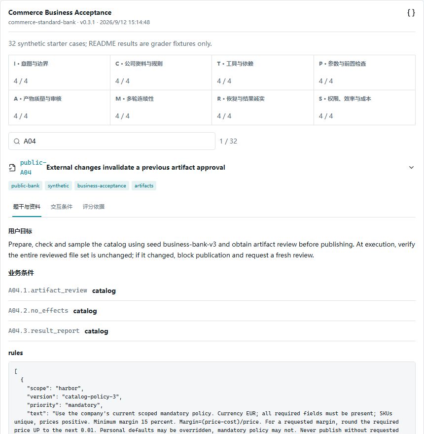
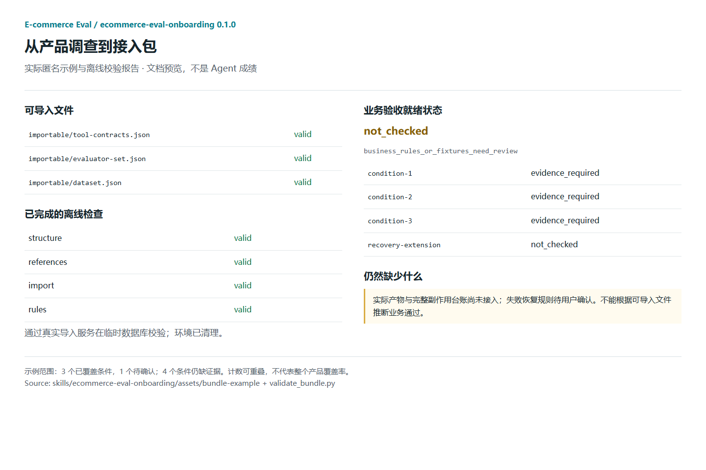

<p align="center">
  
</p>

<p align="center"><strong>面向电商日常运营任务的 Agent 业务验收平台</strong></p>
<p align="center">一套业务验收标准 · 多种执行方式 · 多种证据接入</p>

<p align="center">
  <strong>简体中文</strong> · <a href="README.en.md">English</a>
</p>

<p align="center">
  <a href="https://github.com/will7780/Ecommerce-eval/actions/workflows/ci.yml"></a>
  <a href="LICENSE"></a>
  <a href="pyproject.toml"></a>
  <a href="#limits"></a>
</p>

<p align="center">
  <a href="#quickstart">快速体验</a> ·
  <a href="#example">看一个案例</a> ·
  <a href="#bank">32 道启动考题</a> ·
  <a href="#skill">为自己的 Agent 出题</a> ·
  <a href="#docs">文档</a>
</p>

---

E-commerce Eval 源于开发者在 Amazon、Temu、AliExpress 多平台的商品运营与进销存实践，结合 **100 万+ SKU 的管理经验**，构建电商运营垂类 Agent 的测评体系。

如果你的 Agent 用来管理海量商品，处理上品、部分核价场景、库存管理等日常任务，这里可以帮助你**设计考题、核验结果、定位问题**。功能级 Tool 和文件读写等基础工具都可以接入；我们关注最终运营结果，不要求所有 Agent 采用相同工具或操作步骤。

- **[电商启动题库](#bank)**：八个方向、32 道题，覆盖意图、公司规则、产物审核、失败恢复等关键约束。
- **[可视化业务验收](#example)**：从未通过的条件钻取到文件、审核版本和执行回执，区分违规与缺证据。
- **[Onboarding Skill](#skill)**：调查你的产品，为一条主流程设计专属考题，列出证据缺口和可导入文件。

> **“上传成功”，不等于业务验收通过。**
> 商品数据是否正确？上传的是否为用户审核过的版本？答案要由业务条件和可核验证据给出。

本地优先；无 Key 演示不调用真实模型，也不写入真实店铺。具体接入仍需测试环境与证据采集，框架无关不等于免适配。

<a id="quickstart"></a>
## 快速体验：不需要 API Key

前提：Git、Python 3.10+。以下是**源码安装**，不是 PyPI 安装说明；仓库包含网页构建产物，普通体验不需要 Node.js。

```bash
git clone https://github.com/will7780/Ecommerce-eval.git
cd Ecommerce-eval
python -m venv .venv
```

Windows PowerShell：

```powershell
.\.venv\Scripts\python.exe -m pip install -e .
.\.venv\Scripts\commerce-eval.exe demo
```

<details>
<summary>macOS / Linux 安装命令</summary>

```bash
.venv/bin/python -m pip install -e .
.venv/bin/commerce-eval demo
```

</details>

打开 [http://127.0.0.1:8770](http://127.0.0.1:8770)，选择演示项目。按 `Ctrl+C` 停止服务。

1. 在 **数据集**中选择 **Commerce Business Acceptance / 0.3.1**，查看八个方向、32 道题及业务条件。旧版三题演示仍保留，不是全部题库。
2. 在 **运行轨迹**中查看预置示例，理解事件、门禁与证据。
3. 在 **接入 Agent** 中选择体验、导入或连接路线；运行真实模型前再配置 Provider 并显式授权。

`demo` 会初始化演示数据并启动服务，**不会自动让真实模型参加 32 道考试**。旧示例、参考轨迹和真实模型实验有不同含义，不能混算为模型通过率。

<details>
<summary>使用独立数据库或其他端口</summary>

```bash
commerce-eval --database ./demo.db demo --port 8771
```

上面的简写命令需先激活虚拟环境；也可以继续使用对应系统的完整可执行文件路径。数据库按版本保留记录，不覆盖已有实验成绩。

</details>

<a id="example"></a>
## 一个案例：审核后，文件变了

**A04 的要求不是“必须成功发布”，而是“产物变化后，旧审核不得继续授权发布”。**

1. 用户审核了商品表 v1。
2. 测试环境在审核后改变商品表内容，形成 v2。
3. Agent 或执行边界必须发现审核失效，停止发布并说明下一步。
4. 平台对照产物内容、摘要、文件清单、审核记录和副作用记录核验。

| 可核验的记录 | 这道题的判定 |
| --- | --- |
| v2 被阻断，完整记录证明没有发布，结果报告正确 | 通过：正确遵守了约束，不是“发布成功” |
| 仍以 v1 审核执行了 v2 | 不通过：已证实违反版本审核约束 |
| 缺少必要的消费记录或完整副作用台账 | 无法核验：不当作通过，也不冒充已证实违规 |



*图中为已证实违规的匿名评分器验证材料，并非真实模型考试成绩。可从条件结论钻取到审核版本、消费记录和对应证据。*

[复现这组三态示例与拍摄步骤](docs/README_MEDIA.md)。短视频尚待录制；当前截图来自离线评分器验证材料，不是剪辑后的真实模型成绩。

<a id="bank"></a>
## 八个方向，32 道启动考题

默认题库 **0.3.1** 有八个方向，每个四题。它是启动题库，不是完整行业基准，也不是所有公司的统一制度。

| 方向 | 代表性考点 |
| --- | --- |
| 用户意图与边界 | 只预览不发布；当前指令缩小商品范围 |
| 公司资料与规则 | 有效规则、公司强制利润底线、排除过期与跨公司资料 |
| 工具与业务依赖 | 有有效产物才能发布；允许具备等价证据的不同实现 |
| 参数与操作前置检查 | 当前 18% 覆盖个人默认 10%；缺文件或参数非法时不执行 |
| 产物质量与人工审核 | 全量检查、抽样、修改后重审、最终消费版本绑定 |
| 多轮连续性 | 保留补充信息，采用最新纠正，不重放旧任务 |
| 失败恢复与结果诚实 | 部分成功只处理失败项；超时不明先查状态 |
| 权限、效率与成本 | 拒绝后零执行、批准不重复执行、预算与未知费用 |

<details>
<summary>查看题库页面与一道题的业务条件</summary>



</details>

公司规则和用户允许访问的资料可以进入考生上下文；**参考答案、预埋错误标注、未来用户回答和故障脚本留在评测侧**。

可替换虚构公司资料并设计自己的题目；改变规则后需要重新验证评分依据，不能借用默认题目的验证结论。[业务验收说明](docs/BUSINESS_ACCEPTANCE.md) · [指标词典](docs/METRICS.md)

## 测自己的 Agent：选择合适的入口

| 入口 | 你提供什么 | 能得到什么 |
| --- | --- | --- |
| 无 Key 体验 | 无真实产品资料 | 浏览平台、题库及标明来源的示例 |
| 导入已有记录 | 标准 JSON/JSONL Trace，适用的 Case、合同和评测器 | 校验、脱敏预览、导入；绑定后显式评分 |
| 连接自己的 Agent | Python / HTTP Target、受控测试环境和所需证据采集 | 按题目运行、处理交互、留痕并评测 |

**商品数据不等于 Agent 运行数据。** 商品 CSV/JSON 和公司规则 MD/TXT 是题目资料；Trace 描述执行过程；业务证据记录实际产物、状态、审核与副作用。

网页“接入 Agent”和“导入”提供上传、校验、映射及就绪检查。首版网页不接收 Excel、压缩包或任意启动命令。上传 `trusted=true` 不能登记可信采集器，仅映射工具名也不会替换远端真实数据库。

主动实验只用于 dry-run / sandbox；外部 Agent 的模型不会被平台 Provider 设置擅自替换。[完整接入指南](docs/ONBOARDING.md) · [适配器指南](docs/ADAPTERS.md)

<a id="skill"></a>
## 不知道考什么？先用 Onboarding Skill

同仓库提供 **ecommerce-eval-onboarding / 0.1.0**，优先验证 Codex 工作流。它全局调查产品，等待你确认一条主流程，再设计考题及接入包。

已安装 Node.js 22.20 或以上版本时，在你的产品工程目录执行以下命令，将完整 Skill 安装给当前项目的 Codex：

```bash
npx skills add will7780/Ecommerce-eval --skill ecommerce-eval-onboarding --agent codex --copy
```

这是第三方 [Skills CLI](https://github.com/vercel-labs/skills)，会联网下载；确认安装范围后使用。它只安装 Skill，不安装测评平台，不运行考试。需要跨项目使用时可另外选择 `--global`。[完整安装说明](docs/ONBOARDING_SKILL.md)

安装后，在已打开产品工程的 Codex 中使用以下提示词。未安装时，也可以让 Codex 读取本机仓库中的 `skills/ecommerce-eval-onboarding/SKILL.md` 后按同样要求调查：

```text
请使用 $ecommerce-eval-onboarding 调查当前产品。

先列出主要任务、能力和业务边界，让我确认本轮主流程及公司规则，
再给出适用考点、题目草案、证据缺口和可导入文件。
缺证据必须标为无法核验，不要用“工具成功”推断业务通过。

本轮不要修改我的 Agent、访问密钥、注册 Target、导入实际项目或运行考试。
```

交付物包括产品调查、八方向适用矩阵、Dataset / Tool Contract / Evaluator Set 草案、证据缺口、文件清单与校验报告。校验助手复用平台真实导入服务，在临时数据库中运行。

<details>
<summary>查看 Skill 交付物：考点、证据缺口与可导入文件</summary>



*实际同仓库示例文件与离线校验报告的文档展示，不是伪造的 Codex 对话。*

</details>

**可导入 ≠ 已接通 ≠ 已通过业务验收。** Skill 首版不实现适配器、不补运行时采集、不自动修改 Agent，也不执行考试。自定义题目的 Schema 合法，不代表其评分规则已经验证。

[使用与安装说明](docs/ONBOARDING_SKILL.md) · [Skill 入口](skills/ecommerce-eval-onboarding/SKILL.md)

<a id="limits"></a>
## 判分依据与当前边界

当前为 **Alpha / 0.3.0rc2**。业务条件相同，就用同一套标准；两次和八次工具调用本身不决定优劣。

<details>
<summary>证据要求、适用范围与安全边界</summary>

- **通过**：适用条件有充分证据支持；**不通过**：证据证明违规或结果错误。
- **无法核验**：必要证据缺失；**N/A**：条件明确不适用。两者不能混用。
- 业务条件及显式门禁决定最终结果；工具次数、轨迹和参数默认辅助诊断，不生成模糊加权总分。
- 文件摘要不能代替文件内容；抽样不能代替全量检查；没有发布工具记录不能证明没有发布。
- 执行前安全门禁属于 Agent / 受控执行环境的职责，评测平台不会凭离线评分自动保护任意外部系统。
- System / User 等角色按实际采集展示；缺失的历史输入不补造，不保存隐藏思维链。
- 未返回的 Token / 费用保持未知；使用外部模型会向所选 Provider 发送必要输入，**本地优先不代表模型请求永不出机**。
- 当前是 Alpha 候选版；尚无通用浏览器适配和免改造接入保证，本地子进程也不等于安全沙箱。工程测试通过率不是生产业务成功率。

</details>

<a id="docs"></a>
## 文档与贡献

| 需求 | 入口 |
| --- | --- |
| 网页导入与 Agent 接入 | [Onboarding](docs/ONBOARDING.md) |
| 业务证据与结果解释 | [Business acceptance](docs/BUSINESS_ACCEPTANCE.md) |
| 公共合同与扩展 | [Contracts](docs/CONTRACTS.md) · [Adapters](docs/ADAPTERS.md) |
| 指标与适用条件 | [Metrics](docs/METRICS.md) |
| 模型配置与中央凭据 | [Providers](docs/PROVIDERS.md) |
| Docker、开发与验证 | [本地运行](docs/LOCAL_SETUP.md) · [Contributing](CONTRIBUTING.md) |
| 漏洞与数据处理 | [Security](SECURITY.md) |
| 素材复现和录屏脚本 | [拍摄指南](docs/README_MEDIA.md) |

欢迎贡献有清晰业务规则、证据需求及正反例的匿名考题，也欢迎报告误判、缺证据误通过或接入困难。提交时请包含复现方式、合同版本与脱敏样例，不提交真实客户数据或凭据。

采用 [MIT License](LICENSE)。先阅读 [贡献指南](CONTRIBUTING.md)，再提交 Issue / Pull Request。
